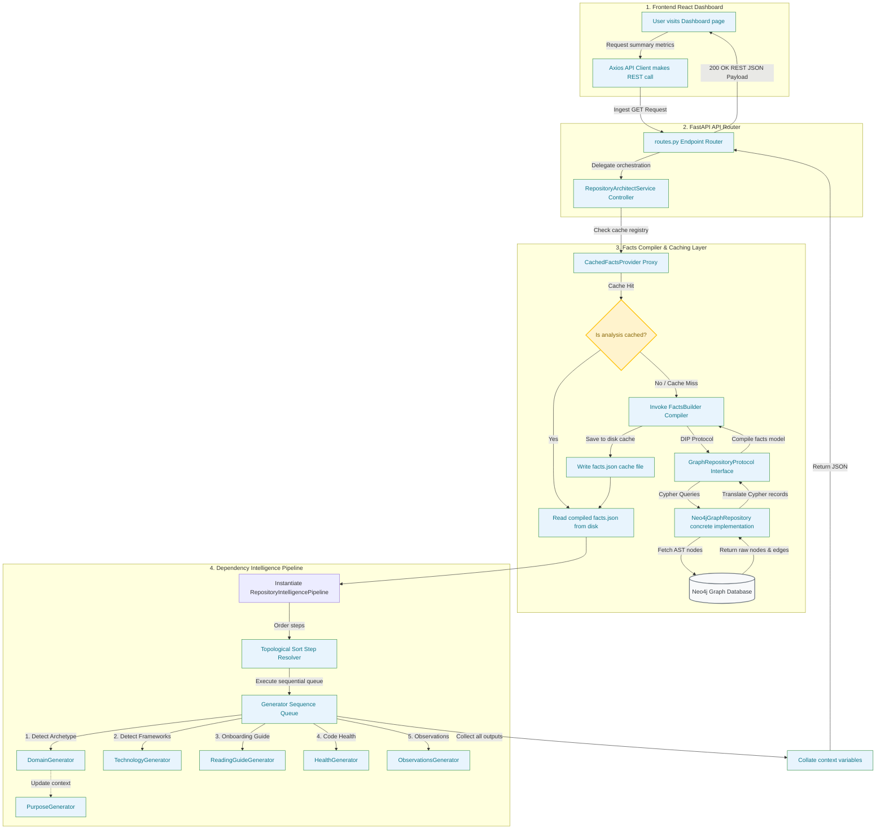

# RepoMind — Repository Intelligence Platform

> **Understanding a large, unfamiliar codebase is one of the most significant bottlenecks for software engineering teams. RepoMind automatically transforms any codebase into an interactive knowledge graph, architectural outline, and AI-powered repository intelligence system.**

---

## 🖥️ Screen Previews
<table width="100%">
  <tr>
    <td width="50%" align="center">
      <b>Landing Page</b><br/>
      

https://github.com/user-attachments/assets/e8390b1e-6338-4e23-bb3d-c1a297c6b3d9

    </td>
    <td width="50%" align="center">
      <b>Interactive System Dashboard</b><br/>
      

https://github.com/user-attachments/assets/4f2319d8-9fe0-4ed8-8418-d59a2cef428b


    </td>
  </tr>
  <tr>
    <td width="100%" align="center" colspan="2">
      <b>System Explorer (Interactive Code Graph & Call Graph)</b><br/>
      

https://github.com/user-attachments/assets/87228dd3-faae-4149-8b3d-fd5d9740cc14


    </td>
  </tr>
</table>

---

## 💡 The Problem & The Solution

### The Problem
When joining a new team or auditing an existing system, engineers spend days manually tracing imports, drawing call graphs on whiteboards, and reading stale documentation just to answer simple questions:
* *“If I modify this class, what modules will break?”*
* *“Who is the primary author of this subsystem, and where is the execution entry point?”*
* *“Are we bypassing our architectural layers with circular dependencies?”*

### The Solution
RepoMind solves this by combining **static analysis (AST parsing)**, **graph database modeling (Neo4j)**, and **AI intelligence generators** into a single pipeline. It extracts code syntax nodes and call hierarchies, imports them into a semantic graph, runs topological sorting to resolve data dependencies, and serves interactive maps alongside AI onboarding summaries.

---

## 📊 Concrete Analysis Example (RepoMind Workspace)
Below are the actual ingestion and execution metrics computed for the **RepoMind** codebase itself:

| Metric | Measured Count / Value |
|---|---|
| **Graph Nodes** | 1,616 semantic entities (Files, Classes, Functions, Authors) |
| **Graph Edges** | 10,694 relationships (`CALLS`, `IMPORTS`, `DEFINES`, `CHANGED`) |
| **Analyzed Functions** | 314 functions |
| **Analyzed Classes** | 67 classes |
| **Parsed Imports** | 128 import paths |
| **Generated Reports** | 11 specialized architectural insights |
| **Total Ingestion Time** | 5.2 seconds |

---

## 🧠 AI-Powered Capabilities & Feature Set

* **Interactive Code Graph**: Visually explore subsystems, classes, and function call hierarchies.
* **AI-Generated Architecture Summaries**: Get high-level domain overviews explaining *why* the codebase is structured the way it is.
* **Onboarding & Reading Guides**: AI-compiled walkthroughs suggesting exactly which files to read first, second, and third.
* **Critical File Detection**: Graph centrality calculations (PageRank) automatically bubble up high-impact bottlenecks.
* **Semantic Search**: Natural language codebase query interface mapping developer questions directly to code coordinates.
* **Commit History & Git Intelligence**: Explore commit graphs mapped directly to altered file nodes and author developers.

---

## 🏗 System Architecture Flowchart



---

## 🛠 Challenges & Engineering Decisions

### 1. Decoupled Pipeline Architecture (Topological Sorting)
* **Challenge**: The intelligence generators (Domain analyzer, Technology classifier, Reading Guide builder) need to consume each other's outputs. Hardcoding execution sequence orders leads to spaghetti orchestration code and fragile coupling.
* **Decision**: Designed a **Dependency-Driven Pipeline Engine**. Each step declares prerequisite inputs via `requires: List[str]` (e.g., `requires = ["tech_stack", "domain_model"]`). The engine builds a dependency DAG at runtime and resolves execution sequence using a **three-state DFS Topological Sort** (`0 = unvisited`, `1 = visiting`, `2 = visited`), detecting and rejecting circular dependencies with `PipelineDependencyError`.

### 2. Isolated Facts Abstraction Layer (Graph Repository Pattern)
* **Challenge**: Directly coupling intelligence generators to Cypher queries makes database schemas hard to change, makes unit testing slow, and saturates Neo4j connection pools.
* **Decision**: Implemented the **Repository Pattern** (`GraphRepositoryProtocol`). This translates complex Cypher graph queries into clean Python dictionary schemas. The `FactsBuilder` consumes this interface, compiling all graph facts (files, imports, call edges) into a canonical JSON model.
* **Result**: Caching is proxy-handled by `CachedFactsProvider` on disk, allowing subsequent pipelines to run instantly and completely database-free.

---

## 🏗 Directory Structure

```text
backend/
├── app/
│   ├── api/
│   │   └── routes.py                 # REST Endpoints mapping web clients to controllers
│   ├── models/
│   │   └── schemas.py                # Pydantic Schemas validating requests/responses
│   ├── services/
│   │   ├── repository_architect.py   # Main orchestrator service layer
│   │   └── repository_intelligence/  # Decoupled intelligence pipeline folder
│   │       ├── engine/
│   │       │   ├── pipeline.py       # Dependency resolution, sorting, and cycle checks
│   │       │   ├── context.py        # execution state maps
│   │       │   └── models.py         # Response schemas
│   │       ├── facts/
│   │       │   ├── facts_builder.py  # Compiles all AST and graph parameters into facts dict
│   │       │   ├── graph_repository.py # Interface protocols and concrete Neo4j operations
│   │       │   ├── cache_provider.py # Cache resolution provider proxy
│   │       │   ├── cache.py          # Local facts cache manager
│   │       │   └── graph_analyzer.py # Graph metric calculations (centrality, PageRank)
│   │       └── generators/           # Decoupled pipeline steps
│   │           ├── base_generator.py # Base step class with output_key & requires fields
│   │           ├── domain_generator.py
│   │           ├── technology_generator.py
│   │           ├── purpose_generator.py
│   │           ├── execution_flow_generator.py
│   │           ├── reading_guide_generator.py
│   │           ├── layers_generator.py
│   │           ├── architecture_generator.py
│   │           ├── critical_files_generator.py
│   │           ├── complexity_generator.py
│   │           ├── health_generator.py
│   │           └── observations_generator.py
│   └── main.py                       # FastAPI application entry point
└── requirements.txt
```

---

## ⚙️ Setup and Installation

### Backend Setup
1. Clone the repository and configure a Python virtual environment:
   ```bash
   cd backend
   python3 -m venv venv
   source venv/bin/activate
   pip install -r requirements.txt
   ```
2. Set up environment configurations matching your local Neo4j database instance:
   ```bash
   export NEO4J_URI="bolt://localhost:7687"
   export NEO4J_USER="neo4j"
   export NEO4J_PASSWORD="password"
   ```
3. Run the FastAPI development server:
   ```bash
   uvicorn app.main:app --reload --port 8000
   ```

### Frontend Setup
1. Install node dependencies:
   ```bash
   npm install
   ```
2. Start the local Vite development server:
   ```bash
   npm run dev
   ```
   Open [http://localhost:5173](http://localhost:5173) in your browser to access the dashboard.
