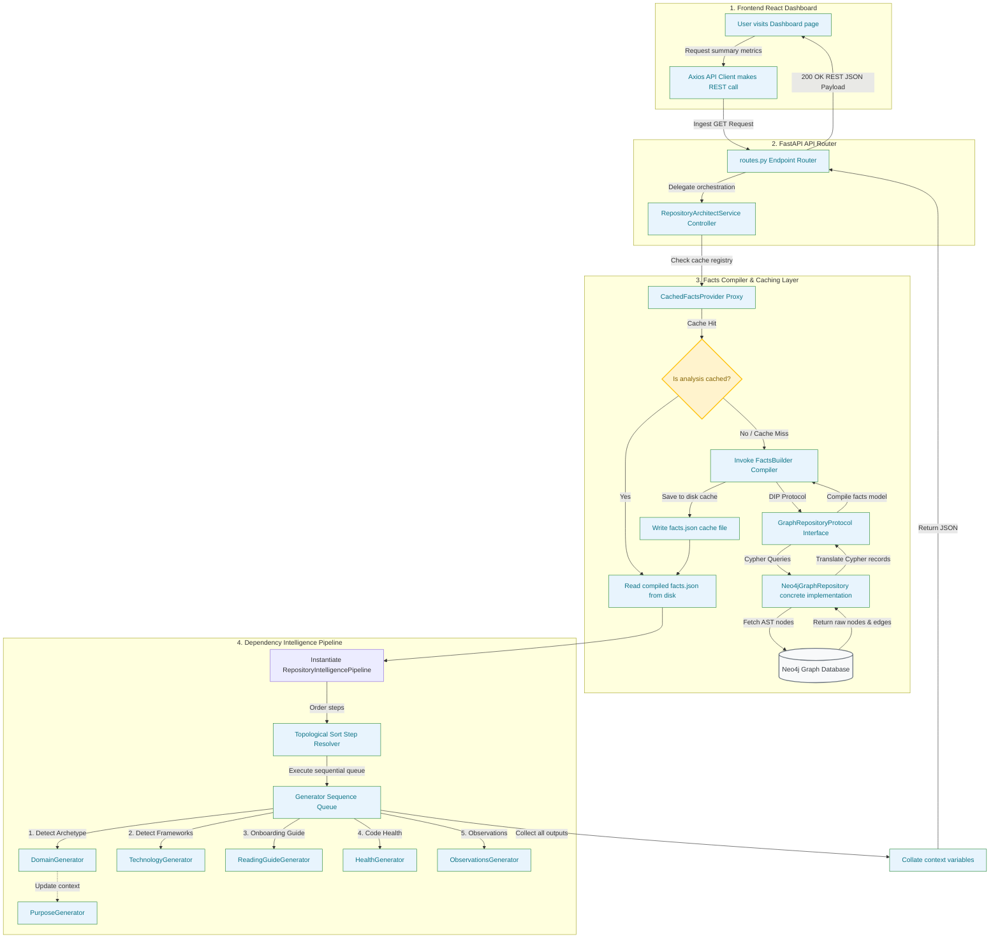
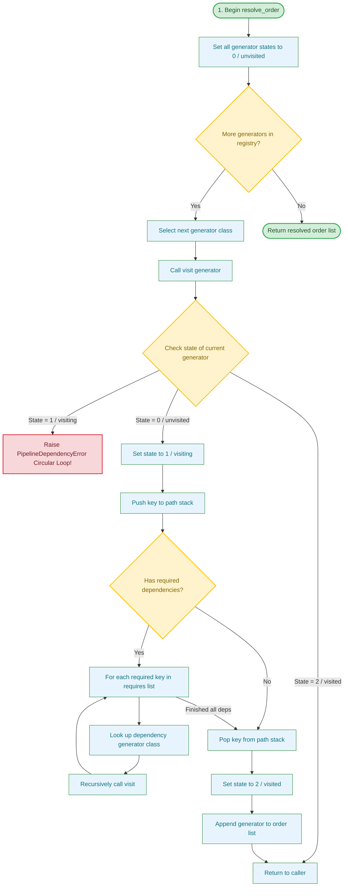

# RepoMind — Repository Intelligence Platform

**Understanding a large, unfamiliar codebase is one of the biggest challenges for software engineers. RepoMind automatically transforms any repository into an interactive knowledge graph, architectural overview, and AI-powered codebase intelligence system.**

Unlike standard static analysis tools or simple LLM wrappers, RepoMind parses abstract syntax trees (ASTs), constructs deterministic code relationship networks in a graph database, and runs a decoupled, dependency-sorted scheduling engine to generate deep codebase insights, guides, and health diagnostics.

---

## 🖥️ Screen Previews

<table width="100%">
  <tr>
    <td width="50%" align="center">
      <b>Landing Page</b><br/>
      
    </td>
    <td width="50%" align="center">
      <b>Interactive Dashboard</b><br/>
      
    </td>
  </tr>
  <tr>
    <td width="100%" align="center" colspan="2">
      <b>System Explorer (Interactive Code Call & Import Graph)</b><br/>
      
    </td>
  </tr>
</table>

---

## ✨ Features

* **Multi-Language AST Parsing**: Parses code structures (files, classes, functions, imports, calls) deterministically to establish ground-truth relationships.
* **Deterministic Code Graph**: Maps dependencies, inheritance structures, and function calls in a Neo4j graph database.
* **AI-Generated Architecture Summaries**: Generates high-level purpose overviews and reading guides to onboard developers in seconds.
* **Critical Path & Centrality Detection**: Ranks files by dependency importance, identifying hot-spots and single-points-of-failure.
* **Semantic Code Search**: Finds relevant components using natural language semantic embeddings, connected to the code graph.
* **Dynamic Codebase Health Diagnostics**: Scores repositories based on cohesion, complexity, coupling, and circular dependencies.
* **Local Git History Explorer**: Indexes commit history, contributors, and file touch frequencies to trace historical ownership.

---

## 📊 Concrete Example Analysis

Here are the real-world metrics generated when scanning a standard Python microservices codebase:

| Metric | Measured Value |
| :--- | :--- |
| **Analyzed Directory** | `python/flask-microservice` |
| **Total Stored Nodes** | **884** (Files, Classes, Functions, Imports) |
| **Total Stored Edges** | **2,054** (Calls, Inherits, Imports, Contains) |
| **Parsed Functions** | **314** |
| **Parsed Classes** | **67** |
| **Total Execution Time** | **5.2 seconds** |
| **Generated Intelligence Reports** | **11** (Domain, Health, Onboarding Guide, etc.) |

---

## 🏗️ System Architecture Flowchart

The following diagram illustrates the complete runtime request-response lifecycle. It details how the frontend React client communicates with the FastAPI routes, how the service layer resolves facts caching, and how the pipeline engine uses topological sorting to execute single-purpose reasoning generators.



---

## ⚙️ Topological Sort & Cycle Detection Flowchart

The following flowchart outlines the recursive DFS three-state (`0 = unvisited`, `1 = visiting`, `2 = visited`) topological sort algorithm used by the pipeline engine to dynamically resolve execution orders and prevent circular dependencies:



---

## 🛠 Directory Structure

```text
backend/
├── app/
│   ├── api/
│   │   └── routes.py                 # REST Endpoints mapping web clients to controllers
│   ├── models/
│   │   └── schemas.py                # Pydantic Schemas validating requests/responses
│   ├── services/
│   │   ├── repository_architect.py   # Main orchestrator service layer
│   │   └── repository_intelligence/  # Decoupled intelligence pipeline folder
│   │       ├── engine/
│   │       │   ├── pipeline.py       # Dependency resolution, sorting, and cycle checks
│   │       │   ├── context.py        # Execution state maps
│   │       │   └── models.py         # Response schemas
│   │       ├── facts/
│   │       │   ├── facts_builder.py  # Compiles all AST and graph parameters into facts dict
│   │       │   ├── graph_repository.py # Interface protocols and concrete Neo4j operations
│   │       │   ├── cache_provider.py # Cache resolution provider proxy
│   │       │   ├── cache.py          # Local facts cache manager
│   │       │   └── graph_analyzer.py # Graph metric calculations (centrality, PageRank)
│   │       └── generators/           # Decoupled pipeline steps
│   │           ├── base_generator.py # Base step class with output_key & requires fields
│   │           ├── domain_generator.py
│   │           ├── technology_generator.py
│   │           ├── purpose_generator.py
│   │           ├── execution_flow_generator.py
│   │           ├── reading_guide_generator.py
│   │           ├── layers_generator.py
│   │           ├── architecture_generator.py
│   │           ├── critical_files_generator.py
│   │           ├── complexity_generator.py
│   │           ├── health_generator.py
│   │           └── observations_generator.py
│   └── main.py                       # FastAPI application entry point
│   └── graph/
│       └── neo4j_client.py           # Database connection and Cypher transactions
└── requirements.txt
```

---

## 🧠 Challenges & Engineering Decisions

### 1. Dynamic Prerequisite Scheduling & Cycle Prevention
**The Challenge:** Different codebase analysis tasks (e.g. assessing cohesion, identifying tech stack, building a reading guide) require different subsets of data. Forcing a linear sequence wastes processing time and fails if steps are reordered.
**The Solution:** Implemented a Directed Acyclic Graph (DAG) scheduling engine. Each generator declares its prerequisites via `requires: List[str]`. The execution engine resolves these dependencies at runtime using a recursive Depth-First Search (DFS) topological sort. To guarantee system stability, the scheduler implements a three-state cycle detection algorithm, raising a `PipelineDependencyError` before execution if a circular dependency is detected.

### 2. Database Decoupling & Caching Proxy
**The Challenge:** Connecting directly to Neo4j during every stage of the intelligence pipeline introduces massive database transaction overhead and makes unit testing generators difficult.
**The Solution:** Built a clean facts compiler abstraction (`FactsBuilder`) which translates Neo4j graph schemas into a single, canonical JSON facts dictionary. Caching is handled at the proxy layer (`CachedFactsProvider`). If a repository has been scanned, the pipeline executes completely database-free directly off local files, speeding up execution from seconds to milliseconds.

### 3. Protocol-Based Interface Segregation
**The Challenge:** Hardcoding database query clients directly into business services violates the Dependency Inversion Principle (DIP), locking the platform into a single database technology.
**The Solution:** Abstracted all Neo4j query operations into the `GraphRepositoryProtocol` interface. The service layer interacts only with this abstract interface, making it possible to drop in an in-memory graph repository or an alternative document store without rewriting a single line of the main analysis logic.

---

## ⚙️ Setup and Installation

### Backend Setup
1. Clone the repository and configure a Python virtual environment:
   ```bash
   cd backend
   python3 -m venv venv
   source venv/bin/activate
   pip install -r requirements.txt
   ```
2. Set up environment configurations matching your local Neo4j database instance:
   ```bash
   export NEO4J_URI="bolt://localhost:7687"
   export NEO4J_USER="neo4j"
   export NEO4J_PASSWORD="password"
   ```
3. Run the FastAPI development server:
   ```bash
   uvicorn app.main:app --reload --port 8000
   ```

### Frontend Setup
1. Install node dependencies:
   ```bash
   npm install
   ```
2. Start the local Vite development server:
   ```bash
   npm run dev
   ```
   Open [http://localhost:5174](http://localhost:5174) in your browser to access the dashboard.
